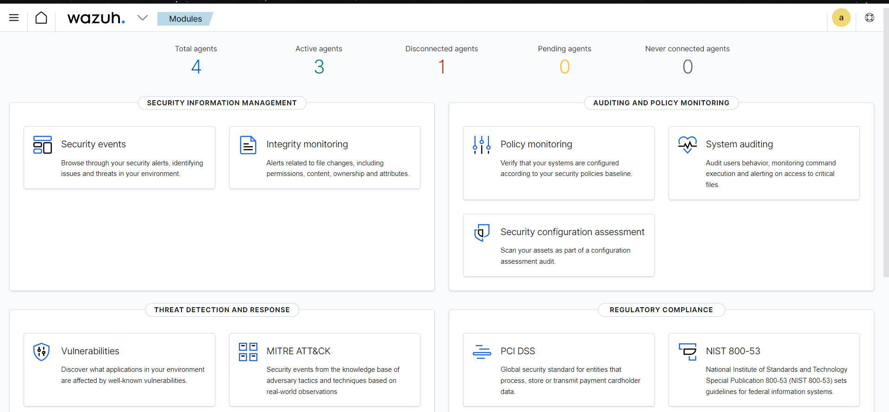
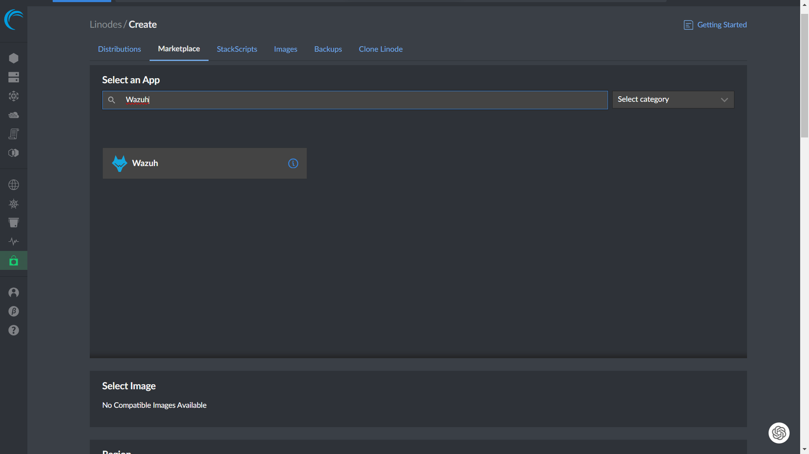
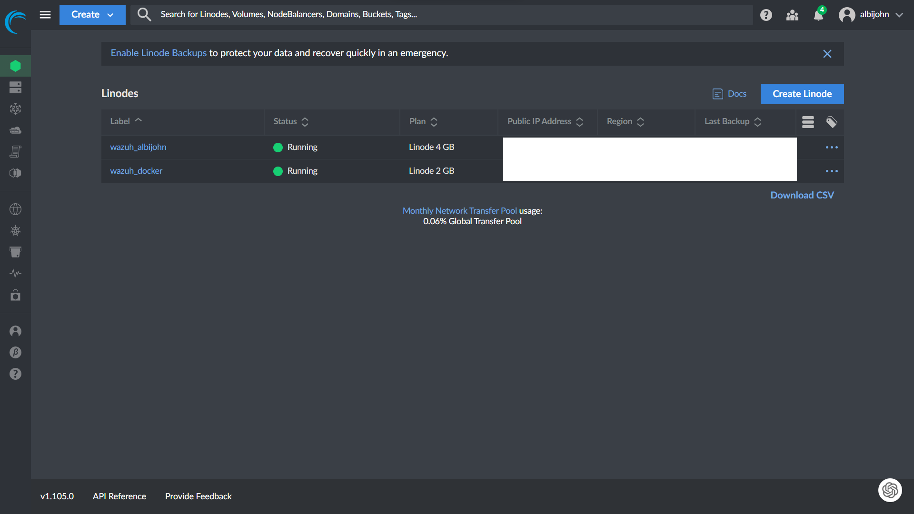
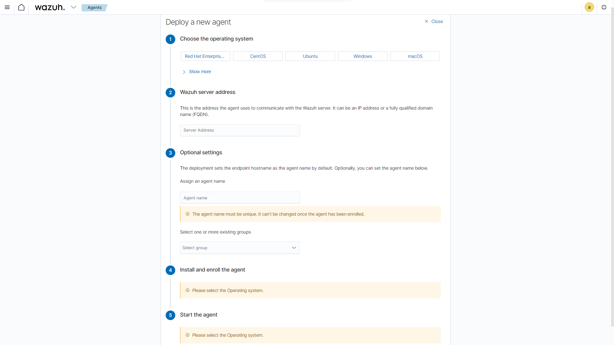
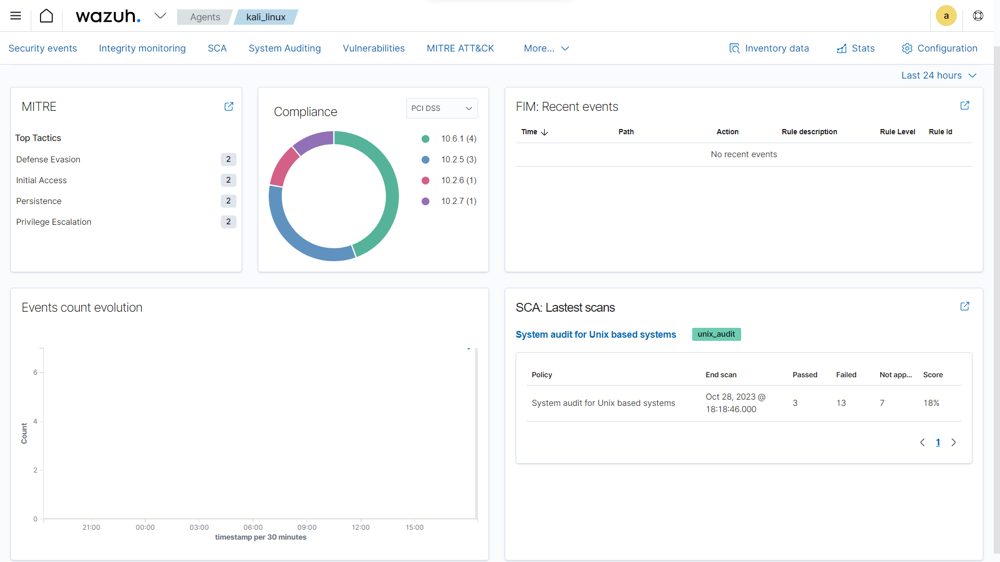

# DIY SIEM Environment


---

## Meet Wazuh
Wazuh is a robust and open-source security information and event management (SIEM) platform that provides real-time security monitoring, threat detection, and response capabilities. It helps organizations protect their digital assets by analyzing security events, logs, and anomalies, all in a centralized and user-friendly interface. With Wazuh, you can fortify your security posture and swiftly respond to potential threats, making it an invaluable tool in today's ever-evolving cybersecurity landscape.

---

### Key Features of Wazuh
Here are the key features that make Wazuh stand out as a formidable cybersecurity tool:

1. **Cross-Platform Compatibility:** Wazuh works seamlessly on a variety of operating systems, including Windows, Linux, and macOS.
2. **Security Configuration Assessment:** Wazuh conducts in-depth checks to identify misconfigurations across your devices. This feature ensures that your systems are correctly configured for optimum security.
3. **Vulnerability Scanning:** Regular scans for known vulnerabilities and malware help keep your systems up to date and secure. Wazuh's vigilant scanning keeps you informed about potential threats.
4. **File and Registry Monitoring:** Wazuh keeps a watchful eye on your directories and Windows registry, providing real-time alerts for any changes. This level of detail is essential for quickly identifying unauthorized modifications and potential security breaches.
5. **Centralized Monitoring:** All data collected by Wazuh is centralized on a dedicated server. This centralized approach simplifies the task of overseeing your cybersecurity measures, making it easier to manage your defenses.
6. **Alerts and Notifications:** Wazuh ensures that you stay informed with real-time alerts delivered through email or Slack. This feature is particularly valuable for businesses and IT professionals who require swift responses to security issues.
7. **Windows Registry Tracking:** The tool goes above and beyond by tracking changes to the Windows registry. This feature alone is a game-changer for your cybersecurity strategy.

[](images/Screenshot-3-e1698455982814.png)
*Wazuh dashboard*

---

### SETTING UP WAZUH:
Setting up Wazuh is a straightforward process. I suggest Linode, a reliable cloud provider with data centers in various locations, making it an ideal choice for hosting Wazuh. 

- **Install Wazuh:** You can install Wazuh on a Linode server from a template by creating a Linode instance and following the official Wazuh installation instructions for your chosen Linux distribution.


- **Setup a Docker container:** Here I am using Ubuntu as the docker. *A **Docker** container is a lightweight, portable, and self-sufficient software package that includes everything needed to run an application, making it easy to deploy and manage software across different environments.*


- **Install docker and docker compose:**

```bash
# Update the package list
sudo apt update

# Install Docker
sudo apt install docker.io

# Install Docker Compose
sudo apt install docker-compose
```

- **Adding Agents:** To deploy new agents in Wazuh, you need to install the Wazuh agent software on the target system and configure it to communicate with the Wazuh manager.


- **Customize Monitoring:** Wazuh allows for tailored configurations to meet your specific needs. This includes real-time monitoring, ruleset customization, and active response management.


---

### Why you should try Wazuh
Wazuh is not only an effective cybersecurity tool but also a valuable educational resource. It empowers you with practical experience in deploying and managing a security tool, making it an excellent addition to your cybersecurity skill set and resume.

In conclusion, cybersecurity is paramount in our digital age, and Wazuh offers a powerful solution. With features such as real-time monitoring, vulnerability scanning, and centralized management, it's an opportunity to secure your digital assets and gain valuable expertise in cybersecurity.

Why not give Wazuh a try? It's a no-brainer – it safeguards your assets, enhances your skills, and comes at no cost. It might just become your go-to cybersecurity tool in your digital defense strategy!!!!!

---

### References:
- Wazuh documentation: [https://documentation.wazuh.com/current/index.html](https://documentation.wazuh.com/current/index.html)
- Install docker engine on Ubuntu: [https://docs.docker.com/engine/install/ubuntu/](https://docs.docker.com/engine/install/ubuntu/)
